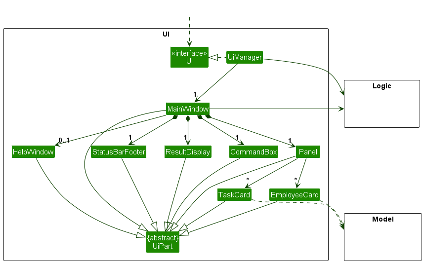
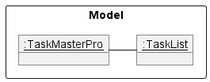
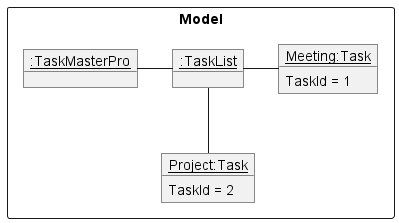
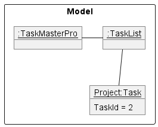
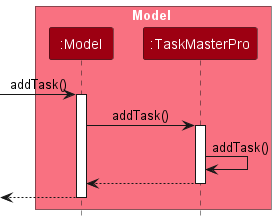
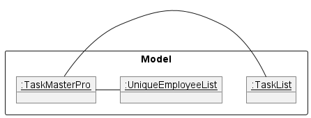
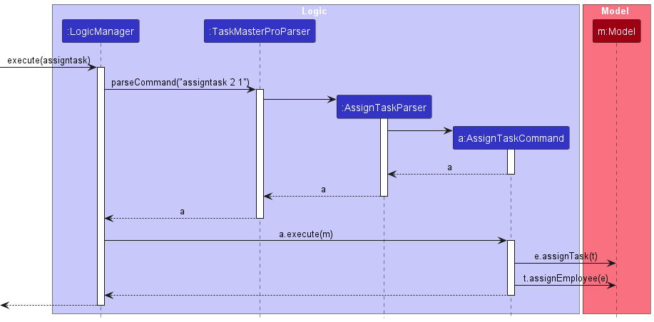
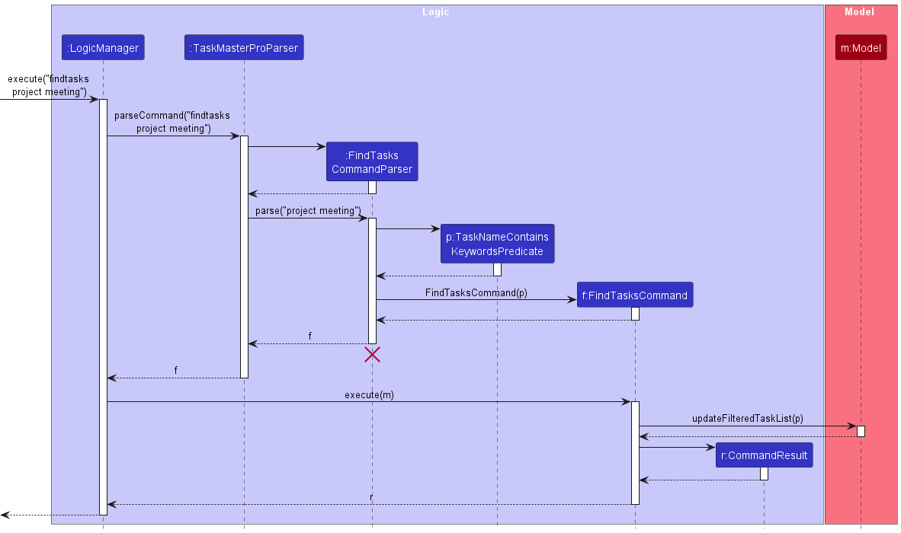
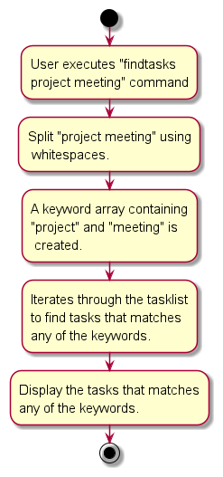

* Table of Contents
{:toc}

--------------------------------------------------------------------------------------------------------------------

## **Acknowledgements**

* This project is based on the AddressBook-Level3 project created by the [SE-EDU initiative](https://se-education.org).

--------------------------------------------------------------------------------------------------------------------

## **Setting up, getting started**

Refer to the guide [_Setting up and getting started_](SettingUp.md).

--------------------------------------------------------------------------------------------------------------------

## **Design**

:bulb: **Tip:** The `.puml` files used to create diagrams in this document `docs/diagrams` folder. Refer to the [_PlantUML Tutorial_ at se-edu/guides](https://se-education.org/guides/tutorials/plantUml.html) to learn how to create and edit diagrams.

### Architecture

The ***Architecture Diagram*** given above explains the high-level design of the App.

Given below is a quick overview of main components and how they interact with each other.

**Main components of the architecture**

**`Main`** (consisting of classes [`Main`](https://github.com/se-edu/TaskMasterPro-level3/tree/master/src/main/java/seedu/address/Main.java) and [`MainApp`](https://github.com/se-edu/TaskMasterPro-level3/tree/master/src/main/java/seedu/address/MainApp.java)) is in charge of the app launch and shut down.
* At app launch, it initializes the other components in the correct sequence, and connects them up with each other.
* At shut down, it shuts down the other components and invokes cleanup methods where necessary.

The bulk of the app's work is done by the following four components:

* [**`UI`**](#ui-component): The UI of the App.
* [**`Logic`**](#logic-component): The command executor.
* [**`Model`**](#model-component): Holds the data of the App in memory.
* [**`Storage`**](#storage-component): Reads data from, and writes data to, the hard disk.

[**`Commons`**](#common-classes) represents a collection of classes used by multiple other components.

**How the architecture components interact with each other**

The *Sequence Diagram* below shows how the components interact with each other for the scenario where the user issues the command `delete 1`.

Each of the four main components (also shown in the diagram above),

* defines its *API* in an `interface` with the same name as the Component.
* implements its functionality using a concrete `{Component Name}Manager` class (which follows the corresponding API `interface` mentioned in the previous point.

For example, the `Logic` component defines its API in the `Logic.java` interface and implements its functionality using the `LogicManager.java` class which follows the `Logic` interface. Other components interact with a given component through its interface rather than the concrete class (reason: to prevent outside component's being coupled to the implementation of a component), as illustrated in the (partial) class diagram below.

The sections below give more details of each component.

### UI component

The **API** of this component is specified in [`Ui.java`](https://github.com/se-edu/TaskMasterPro-level3/tree/master/src/main/java/seedu/address/ui/Ui.java)

The UI consists of a `MainWindow` that is made up of parts e.g.`CommandBox`, `ResultDisplay`, `EmployeeListPanel`, `StatusBarFooter` etc. All these, including the `MainWindow`, inherit from the abstract `UiPart` class which captures the commonalities between classes that represent parts of the visible GUI.

The `UI` component uses the JavaFx UI framework. The layout of these UI parts are defined in matching `.fxml` files that are in the `src/main/resources/view` folder. For example, the layout of the [`MainWindow`](https://github.com/se-edu/TaskMasterPro-level3/tree/master/src/main/java/seedu/address/ui/MainWindow.java) is specified in [`MainWindow.fxml`](https://github.com/se-edu/TaskMasterPro-level3/tree/master/src/main/resources/view/MainWindow.fxml)

The `UI` component,

* executes user commands using the `Logic` component.
* listens for changes to `Model` data so that the UI can be updated with the modified data.
* keeps a reference to the `Logic` component, because the `UI` relies on the `Logic` to execute commands.
* depends on some classes in the `Model` component, as it displays `Employee` object residing in the `Model`.

### Logic component

**API** : [`Logic.java`](https://github.com/se-edu/TaskMasterPro-level3/tree/master/src/main/java/seedu/address/logic/Logic.java)

Here's a (partial) class diagram of the `Logic` component:

The sequence diagram below illustrates the interactions within the `Logic` component, taking `execute("delete 1")` API call as an example.

:information_source: **Note:** The lifeline for `DeleteCommandParser` should end at the destroy marker (X) but due to a limitation of PlantUML, the lifeline continues till the end of diagram.

How the `Logic` component works:

1. When `Logic` is called upon to execute a command, it is passed to an `TaskMasterProParser` object which in turn creates a parser that matches the command (e.g., `DeleteCommandParser`) and uses it to parse the command.
1. This results in a `Command` object (more precisely, an object of one of its subclasses e.g., `DeleteCommand`) which is executed by the `LogicManager`.
1. The command can communicate with the `Model` when it is executed (e.g. to delete a employee). 
   Note that although this is shown as a single step in the diagram above (for simplicity), in the code it can take several interactions (between the command object and the `Model`) to achieve.
1. The result of the command execution is encapsulated as a `CommandResult` object which is returned back from `Logic`.

Here are the other classes in `Logic` (omitted from the class diagram above) that are used for parsing a user command:

How the parsing works:
* When called upon to parse a user command, the `TaskMasterProParser` class creates an `XYZCommandParser` (`XYZ` is a placeholder for the specific command name e.g., `AddCommandParser`) which uses the other classes shown above to parse the user command and create a `XYZCommand` object (e.g., `AddCommand`) which the `TaskMasterProParser` returns back as a `Command` object.
* All `XYZCommandParser` classes (e.g., `AddCommandParser`, `DeleteCommandParser`, ...) inherit from the `Parser` interface so that they can be treated similarly where possible e.g, during testing.

### Model component
**API** : [`Model.java`](https://github.com/se-edu/TaskMasterPro-level3/tree/master/src/main/java/seedu/address/model/Model.java)

The `Model` component,

* stores the TaskMasterPro data i.e., all `Employee` objects (which are contained in a `UniqueEmployeeList` object) and all `Task` objects (which are contained in a `TaskList` object.
* stores the currently 'selected' `Employee` objects (e.g., results of a search query) as a separate _filtered_ list which is exposed to outsiders as an unmodifiable `ObservableList<Employee>` that can be 'observed' e.g. the UI can be bound to this list so that the UI automatically updates when the data in the list change.
* stores `Task` objects in a similar manner as with `Employee` objects.
* stores a `UserPref` object that represents the user’s preferences. This is exposed to the outside as a `ReadOnlyUserPref` objects.
* does not depend on any of the other three components (as the `Model` represents data entities of the domain, they should make sense on their own without depending on other components)

:information_source: **Note:** An alternative (arguably, a more OOP) model is given below. It has a `Tag` list in the `TaskMasterPro`, which `Employee` references. This allows `TaskMasterPro` to only require one `Tag` object per unique tag, instead of each `Employee` needing their own `Tag` objects. 

### Storage component

**API** : [`Storage.java`](https://github.com/se-edu/TaskMasterPro-level3/tree/master/src/main/java/seedu/address/storage/Storage.java)

The `Storage` component,
* can save both TaskMasterPro data and user preference data in JSON format, and read them back into corresponding objects.
* inherits from both `TaskMasterProStorage` and `UserPrefStorage`, which means it can be treated as either one (if only the functionality of only one is needed).
* depends on some classes in the `Model` component (because the `Storage` component's job is to save/retrieve objects that belong to the `Model`)

### Common classes

Classes used by multiple components are in the `seedu.TaskMasterPro.commons` package.

--------------------------------------------------------------------------------------------------------------------

## **Implementation**

This section describes some noteworthy details on how certain features are implemented.

### \[Proposed\] Undo/redo feature

#### Proposed Implementation

The proposed undo/redo mechanism is facilitated by `VersionedTaskMasterPro`. It extends `TaskMasterPro` with an undo/redo history, stored internally as an `TaskMasterProStateList` and `currentStatePointer`. Additionally, it implements the following operations:

* `VersionedTaskMasterPro#commit()` — Saves the current TaskMasterPro state in its history.
* `VersionedTaskMasterPro#undo()` — Restores the previous TaskMasterPro state from its history.
* `VersionedTaskMasterPro#redo()` — Restores a previously undone TaskMasterPro state from its history.

These operations are exposed in the `Model` interface as `Model#commitTaskMasterPro()`, `Model#undoTaskMasterPro()` and `Model#redoTaskMasterPro()` respectively.

Given below is an example usage scenario and how the undo/redo mechanism behaves at each step.

Step 1. The user launches the application for the first time. The `VersionedTaskMasterPro` will be initialized with the initial TaskMasterPro state, and the `currentStatePointer` pointing to that single TaskMasterPro state.

Step 2. The user executes `delete 5` command to delete the 5th employee in the TaskMasterPro. The `delete` command calls `Model#commitTaskMasterPro()`, causing the modified state of the TaskMasterPro after the `delete 5` command executes to be saved in the `TaskMasterProStateList`, and the `currentStatePointer` is shifted to the newly inserted TaskMasterPro state.

Step 3. The user executes `add n/David …​` to add a new employee. The `add` command also calls `Model#commitTaskMasterPro()`, causing another modified TaskMasterPro state to be saved into the `TaskMasterProStateList`.

:information_source: **Note:** If a command fails its execution, it will not call `Model#commitTaskMasterPro()`, so the TaskMasterPro state will not be saved into the `TaskMasterProStateList`.

Step 4. The user now decides that adding the employee was a mistake, and decides to undo that action by executing the `undo` command. The `undo` command will call `Model#undoTaskMasterPro()`, which will shift the `currentStatePointer` once to the left, pointing it to the previous TaskMasterPro state, and restores the TaskMasterPro to that state.

:information_source: **Note:** If the `currentStatePointer` is at index 0, pointing to the initial TaskMasterPro state, then there are no previous TaskMasterPro states to restore. The `undo` command uses `Model#canUndoTaskMasterPro()` to check if this is the case. If so, it will return an error to the user rather
than attempting to perform the undo.

The following sequence diagram shows how an undo operation goes through the `Logic` component:

:information_source: **Note:** The lifeline for `UndoCommand` should end at the destroy marker (X) but due to a limitation of PlantUML, the lifeline reaches the end of diagram.

Similarly, how an undo operation goes through the `Model` component is shown below:

The `redo` command does the opposite — it calls `Model#redoTaskMasterPro()`, which shifts the `currentStatePointer` once to the right, pointing to the previously undone state, and restores the TaskMasterPro to that state.

:information_source: **Note:** If the `currentStatePointer` is at index `TaskMasterProStateList.size() - 1`, pointing to the latest TaskMasterPro state, then there are no undone TaskMasterPro states to restore. The `redo` command uses `Model#canRedoTaskMasterPro()` to check if this is the case. If so, it will return an error to the user rather than attempting to perform the redo.

Step 5. The user then decides to execute the command `list`. Commands that do not modify the TaskMasterPro, such as `list`, will usually not call `Model#commitTaskMasterPro()`, `Model#undoTaskMasterPro()` or `Model#redoTaskMasterPro()`. Thus, the `TaskMasterProStateList` remains unchanged.

Step 6. The user executes `clear`, which calls `Model#commitTaskMasterPro()`. Since the `currentStatePointer` is not pointing at the end of the `TaskMasterProStateList`, all TaskMasterPro states after the `currentStatePointer` will be purged. Reason: It no longer makes sense to redo the `add n/David …​` command. This is the behavior that most modern desktop applications follow.

The following activity diagram summarizes what happens when a user executes a new command:

#### Design considerations:

**Aspect: How undo & redo executes:**

* **Alternative 1 (current choice):** Saves the entire TaskMasterPro.
  * Pros: Easy to implement.
  * Cons: May have performance issues in terms of memory usage.

* **Alternative 2:** Individual command knows how to undo/redo by
  itself.
  * Pros: Will use less memory (e.g. for `delete`, just save the employee being deleted).
  * Cons: We must ensure that the implementation of each individual command are correct.

_{more aspects and alternatives to be added}_

### \[Proposed\] Data archiving

_{Explain here how the data archiving feature will be implemented}_

### \[Proposed\] Add/Delete task

#### Current Implementation

The current add/delete task feature is designed in a way such that every task has an unique `TaskId` to uniquely identify each task. This is done as there is no explicit constraint stating that tasks cannot have the same name, as such an identifier is required for other aspects of the TaskMasterPro (namely assigning of tasks to employees).

The unique `TaskId` is assigned by the TaskMasterPro automatically and is also tracked by the TaskMasterPro. It is saved in the common .json file along with other data from TaskMasterPro, and carries over across sessions.

<!--ToDo, add info about corrupt TaskId? -->

Given below is an example usage scenario and how the add/delete task feature behaves at each step.

Step 1. The user launches the TaskMasterPro. Assume that there are no existing tasks.

Step 2. The user enters the command `task Meeting`. This creates a new `Task` object with its `TaskId` automatically assigned. Assume that the `TaskId` value is 1.

Step 3. The user enters the command `task Project`. This creates another new `Task` object with its `TaskId` automatically assigned. Assume that the `TaskId` value is 2.

Step 4. The user now enters the command `deletetask 1`. This will delete the task created in Step 2. as its assigned `TaskId` is 1.

:information_source: **Note:** If an invalid `TaskId` is entered instead, an error will appear informing the user and nothing else will happen.

The following sequence diagram shows how an add task operation goes through the `Logic` component:

:information_source: **Note:** The lifeline for `AddTaskCommand` should end at the destroy marker (X) but due to a limitation of PlantUML, the lifeline reaches the end of diagram.

Similarly, how an add task operation goes through the `Model` component is shown below:

The `deletetask` command works similarly  —  it calls `Model#deleteTask` with a given `TaskId` and deletes the `Task` if it exists.

The following activity diagram summarizes what happens when a user executes a new command:

#### Design considerations:

**Aspect: How to uniquely identify `Task`:**

* **Alternative 1 (current choice):** Using of `taskId`.
    * Pros: Easy to implement. `TaskMasterPro` automatically assigns this value.
    * Cons: May be hard for users to keep track of.

* **Alternative 2:** Using of `taskName`.
    * Pros: An existing field, no additional implementations needed.
    * Cons: Impossible to uniquely identify tasks as there could be tasks with the same name.

### \[Proposed\] Assign/Unassign task

#### Current Implementation

The current assign/unassign task features are designed such that they accept the ids of a task an employee as a parameter.
As mentioned above in Add/Delete task a task or employee can have the same name as another task or employee so their ids are the best way to identify them.

To keep track of the assignment of tasks, every employee has an immutable AssignedTasks and every task has an immutable AssignedEmployees.

This object contains a hashtable, for AssignedTasks it contains the TaskId as a key and the corresponding task as the value for that key.
This is the same for AssignedEmployees which contains a hashtable where EmployeeId is a key and the corresponding employee is the value for that key.
Both of these gets updated for each call to any of the two functions.

There is also a string variable in each AssignedTasks and AssignedEmployees which contains the keys of existing ids separated by an empty space.
This String is stored into the JSON file with each Employee or Task so that assignments can be stored between sessions.

Given below is an example usage scenario and how the assign/unassign task feature behaves at each step.

Step 1. The user launches the TaskMasterPro. Assume that there are existing employee with EmployeeId: 1 and existing task with TaskId: 2 and that both were not already assigned to each other.

Step 2. The user enters the command `assigntask 2 1`. This updates the AssignedTasks of the employee to put the task into the hashtable and add the string " 2" to the existing string as well as the AssignedEmployees of the task to add the employee in the hashtable and add the string " 1" to the existing string.

Step 3. The user enters the command `unassigntask 2 1`. This updates the AssignedTasks of the employee to remove the task from the hashtable and the AssignedEmployees of the task to remove the employee from the hashtable.

Both of the above command will call a function in Task and Employee which will call a function in AssignedEmployees and AssignedTasks respectively.

Step 4. The user now enters the command `unassigntask 2 1` again. This will return an error as they are no longer assigned to each other to begin with.

:information_source: **Note:** If an invalid `TaskId` or `EmployeeId` is entered instead, an error will appear informing the user and nothing else will happen.

The following sequence diagram shows how an assign task operation goes through the `Logic` component:

Similarly, how an assign task operation goes through the `Model` component is shown below:

The following activity diagram summarizes what happens when a user executes a new command:

#### Design considerations:

**Aspect: How to store `AssignedTasks`/`AssignedEmployees` into JSON:**

* **Alternative 1 (current choice):** Using both String variable with the ids separated by spaces and a hashtable for functions to access.
    * Pros: The most straightforward approach. Both approaches described after this requires some complex functions for certain functions.
    * Cons: Whenever we update `AssignedTasks` or `AssignedEmployees` we have to update both the hashtable and the String and ensure that both are in sync.

* **Alternative 2:** Using only the String variable.
    * Pros: Extremely easy to understand.
    * Cons: Each time we want to access any task or employee we have to iterate through the split string and then iterate through every task/employee to compare the ids.

* **Alternative 3:** Using only the hashtable.
    * Pros: We can easily access the assigned tasks and employees so that we do not need to loop and compare every id each function call.
    * Cons: When we try to store or load the stored JSON data to the hashtable we have to go through quite a complicated process to do it in the right order.

### \[Proposed\] Find task by name

#### Current Implementation

The current find task by name feature is designed such that it accepts a string as a parameter.

The string will be split using whitespaces to form keywords and the tasks will be filtered based on whether their names contain at least 1 of the keywords.

The search is case-insensitive and the order of the keywords does not matter.

Only full words are matched, so if the task name is "meeting with client" and the user searches for "meet", the task will not be found.

Given below is an example usage scenario and how the find task by name feature behaves at each step.

Step 1. The user launches the TaskMasterPro. Assume that there are existing tasks with names "Project 1 Meeting", "Client Meeting" and "Complete Project 2".

Step 2. The user enters the command `findtasks meeting`. This returns "Project 1 Meeting" and "Client Meeting".

The following sequence diagram shows how a `findtasks` operation goes through the `Logic` component:

The following activity diagram summarizes what happens when a user executes `findtasks project meeting`:

#### Design considerations:

**Aspect: Whether to make both `find` and `findtasks` inherit from a common parent class:**

This is because both `find` and `findtasks` are similar in terms of functionality. `find` finds employees and `findtasks` finds tasks.

* **Alternative 1 (current choice):** Keep them separate.
    * Pros: Easier to understand and organise because currently all the classes related to employee
    are in the `model.employee` package and all the classes related to task are in the `model.task` package.
    * Cons: There will be code duplication because their implementations are similar.

* **Alternative 2 :** Make both `find` and `findtasks` inherit from a parent class.
    * Pros: Reduces code duplication.
    * Cons: May be harder to understand and organise.

--------------------------------------------------------------------------------------------------------------------

## **Documentation, logging, testing, configuration, dev-ops**

* [Documentation guide](Documentation.md)
* [Testing guide](Testing.md)
* [Logging guide](Logging.md)
* [Configuration guide](Configuration.md)
* [DevOps guide](DevOps.md)

--------------------------------------------------------------------------------------------------------------------

## **Appendix: Requirements**

### Product scope

**Target user profile**: Managers who

* manage many employees
* prefers command line input
* comfortable with manually editing save file

**Value proposition**: manage employees faster than a typical mouse/GUI driven app

### User stories

Priorities: High (must have) - `* * *`, Medium (nice to have) - `* *`, Low (unlikely to have) - `*`

| Priority | As a …​                                    | I want to …​                                 | So that I can…​                                                   |
|---------| ------------------------------------------ |----------------------------------------------|-------------------------------------------------------------------|
| `* * *` | new user                                   | see usage instructions                       | refer to instructions when I forget how to use the App            |
| `* * *` | user                                       | add a new employee                           | keep a employee on record                                         |
| `* * *` | user                                       | delete a employee                            | remove entries that I no longer need                              |
| `* * *` | user                                       | list all recorded employees                  | locate details of all employees in a list                         |
| `* * *` | user                                       | add a new task                               | keep upcoming tasks on record                                     |
| `* * *` | user                                       | delete a task                                | remove entries that I no longer need                              |
| `* * *` | user                                       | list all recorded tasks                      | locate details of all tasks in a list                             |
| `* * *` | user                                       | assign a employee to a tasks                 | keep track of who is supposed to contribute to a task             |
| `* * *` | user                                       | unassign a employee from a task              | update changes in manpower allocation                             |
| `* * *` | user                                       | list all tasks with their assigned employees | locate details of all tasks while seeing who are assigned to them |
| `* * *` | user                                       | mark a task as done                          | keep track of task completion                                     |
| `* * *` | user                                       | unmark a marked task                         | undo wrongly marked tasks                                         |
| `* * *` | user                                       | save current data                            | keep track of all data even after exiting                         |
| `* * *` | user                                       | load saved data                              | use the data that was saved previously                            |
| `* * `  | user                                       | find tasks by name                           | quickly locate specific tasks that I remember                     |
| `*`     | user with many employees in the TaskMasterPro | sort employees by name                       | locate a employee easily                                          |

*{More to be added for v1.3}*

### Use cases

(For all use cases below, the **System** is the `TaskMasterPro` and the **Actor** is the `user`, unless specified otherwise)

**Use case: Delete an employee**

**MSS**

1.  User requests to list employees
2.  TaskMasterPro shows a list of employees with their ids
3.  User requests to delete a specific employee in the list by their id
4.  TaskMasterPro deletes the employee

    Use case ends.

**Extensions**

* 2a. The list is empty.

  Use case ends.

* 3a. The given id is invalid.

    * 3a1. TaskMasterPro shows an error message.

      Use case resumes at step 2.

**Use case: Delete a task**

**MSS**

1.  User requests to list tasks
2.  TaskMasterPro shows a list of tasks with their ids
3.  User requests to delete a specific task in the list by their id
4.  TaskMasterPro deletes the task

    Use case ends.

**Extensions**

* 2a. The list is empty.

  Use case ends.

* 3a. The given id is invalid.

    * 3a1. TaskMasterPro shows an error message.

      Use case resumes at step 2.

**Use case: Assign/unassign an employee to a task**

**MSS**

1.  User requests to list employees
2.  TaskMasterPro shows a list of employees with their ids
3.  User requests to list tasks
4.  TaskMasterPro shows a list of tasks with their ids
5.  User requests to assign/un-assign a specific employee in the employee list by their id to a specific task in the task list by its id
6.  TaskMasterPro assigns/un-assigns the employee to the task

    Use case ends.

**Extensions**

* 2a. The list is empty.

  Use case ends.

* 4a. The list is empty.

  Use case ends.

* 5a. Any given id is invalid.

    * 5a1. TaskMasterPro shows an error message.

      Use case resumes at step 2/4.

**Use case: Mark a task as done**

**MSS**

1.  User requests to list tasks
2.  TaskMasterPro shows a list of tasks with their ids
3.  User requests to mark a specific task in the list by their id as done
4.  TaskMasterPro marks that task as done/not done.

    Use case ends.

**Extensions**

* 2a. The list is empty.

  Use case ends.

* 3a. The given id is invalid.

    * 3a1. TaskMasterPro shows an error message.

      Use case resumes at step 2.

Note that if none of the taskId == 1, an invalid taskId exception will be thrown.

**Use case: Unmark a task as not done**

**MSS**

1.  User requests to list tasks
2.  TaskMasterPro shows a list of tasks with their ids
3.  User requests to unmark a specific task in the list by their id
4.  TaskMasterPro unmarks that task as not done.

    Use case ends.

**Extensions**

* 2a. The list is empty.

  Use case ends.

* 3a. The given id is invalid.

    * 3a1. TaskMasterPro shows an error message.

      Use case resumes at step 2.

Note that if none of the taskId == 1, an invalid taskId exception will be thrown.

### Non-Functional Requirements

1.  Should work on any _mainstream OS_ as long as it has Java `11` or above installed.
2.  Should be able to hold up to 1000 employees without a noticeable sluggishness in performance for typical usage.
3.  A user with above average typing speed for regular English text (i.e. not code, not system admin commands) should be able to accomplish most of the tasks faster using commands than using the mouse.
4.  Should be able to handle a corrupted data file without crashing.

*{More to be added}*

### Glossary

* **Mainstream OS**: Windows, Linux, Unix, MacOS
* **Private contact detail**: A contact detail that is not meant to be shared with others

--------------------------------------------------------------------------------------------------------------------

## **Appendix: Instructions for manual testing**

Given below are instructions to test the app manually.

:information_source: **Note:** These instructions only provide a starting point for testers to work on;
testers are expected to do more *exploratory* testing.

### Launch and shutdown

1. Initial launch

   1. Download the jar file and copy into an empty folder

   1. Double-click the jar file Expected: Shows the GUI with a set of sample contacts. The window size may not be optimum.

1. Saving window preferences

   1. Resize the window to an optimum size. Move the window to a different location. Close the window.

   1. Re-launch the app by double-clicking the jar file. 
       Expected: The most recent window size and location is retained.

1. _{ more test cases …​ }_

### Deleting a employee

1. Deleting a employee while all employees are being shown

   1. Prerequisites: List all employees using the `list` command. Multiple employees in the list.

   1. Test case: `delete 1` 
      Expected: First contact is deleted from the list. Details of the deleted contact shown in the status message. Timestamp in the status bar is updated.

   1. Test case: `delete 0` 
      Expected: No employee is deleted. Error details shown in the status message. Status bar remains the same.

   1. Other incorrect delete commands to try: `delete`, `delete x`, `...` (where x is larger than the list size) 
      Expected: Similar to previous.

1. _{ more test cases …​ }_

### Saving data

1. Dealing with missing/corrupted data files

   1. _{explain how to simulate a missing/corrupted file, and the expected behavior}_

1. _{ more test cases …​ }_
