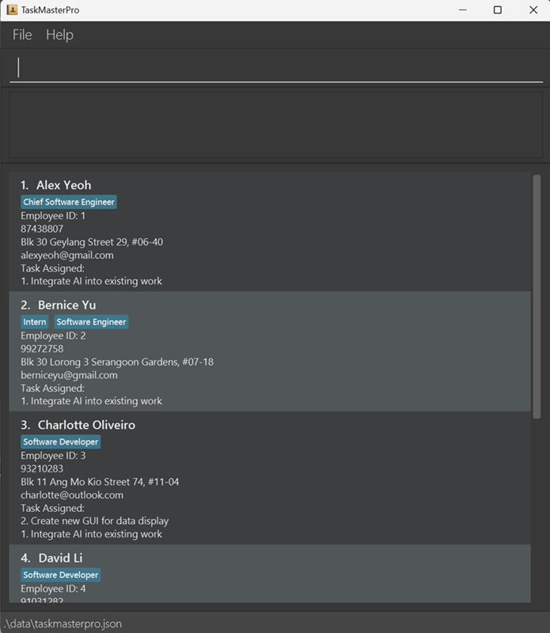

TaskMasterPro is a **desktop app for managing team members and group tasks, optimized for use via a Command Line Interface** (CLI) while still having the benefits of a Graphical User Interface (GUI). If you can type fast, TaskMasterPro can get your contact management tasks done faster than traditional GUI apps.

* Table of Contents
  {:toc}

--------------------------------------------------------------------------------------------------------------------

## Quick start
## This section to be done after v1.2 is released
1. Ensure you have Java `11` or above installed in your Computer.

1. Download the latest `addressbook.jar` from [here](https://github.com/se-edu/addressbook-level3/releases).

1. Copy the file to the folder you want to use as the _home folder_ for your AddressBook.

1. Open a command terminal, `cd` into the folder you put the jar file in, and use the `java -jar addressbook.jar` command to run the application. 
   A GUI similar to the below should appear in a few seconds. Note how the app contains some sample data. 
   

1. Type the command in the command box and press Enter to execute it. e.g. typing **`help`** and pressing Enter will open the help window. 
   Some example commands you can try:

    * `list` : Lists all contacts.

    * `add n/John Doe p/98765432 e/johnd@example.com a/John street, block 123, #01-01` : Adds a contact named `John Doe` to the Address Book.

    * `delete 3` : Deletes the 3rd contact shown in the current list.

    * `clear` : Deletes all contacts.

    * `exit` : Exits the app.

1. Refer to the [Features](#features) below for details of each command.

--------------------------------------------------------------------------------------------------------------------

## Features

**:information_source: Notes about the command format:** 

* Words in `UPPER_CASE` are the parameters to be supplied by the user. 
  e.g. in `add n/NAME`, `NAME` is a parameter which can be used as `add n/John Doe`.

* Items in square brackets are optional. 
  e.g `n/NAME [t/TAG]` can be used as `n/John Doe t/friend` or as `n/John Doe`.

* Items with `…`​ after them can be used multiple times including zero times. 
  e.g. `[t/TAG]…​` can be used as ` ` (i.e. 0 times), `t/friend`, `t/friend t/family` etc.

* Parameters can be in any order. 
  e.g. if the command specifies `n/NAME p/PHONE_NUMBER`, `p/PHONE_NUMBER n/NAME` is also acceptable.

* Extraneous parameters for commands that do not take in parameters (such as `help`, `list`, `exit` and `clear`) will be ignored. 
  e.g. if the command specifies `help 123`, it will be interpreted as `help`.

* If you are using a PDF version of this document, be careful when copying and pasting commands that span multiple lines as space characters surrounding line-breaks may be omitted when copied over to the application.

### Viewing help : `help`

Shows a message explaining how to access the help page.

Format: `help`

### Adding an employee: `add`

Adds an employee to TaskMasterPro.

Format: `add n/NAME p/PHONE_NUMBER e/EMAIL a/ADDRESS [t/TAG]…​`

:bulb: **Tip:**
Make sure that your parameter's formats are valid!

Examples:
* `add n/AikenDueet p/12311231 e/aiken@example.com a/Dueet street, block 123, #01-01`
* `add n/Ben Diddle t/friend e/bendiddle@example.com a/Newgate Prison p/21092109 t/criminal`

### Listing all employees: `list`

Shows a list of all employees in TaskMasterPro.

Format: `listemployees`

### Deleting an employee: `delete`

Deletes the specified employee from TaskMasterPro.

Format: `delete EMPLOYEE_ID`

* The `EMPLOYEE_ID` refers to the index number shown in the displayed employee list.
  Make sure that its valid!

Examples:
* `listemployees` followed by `delete 3` deletes the employee with id 3 in TaskMasterPro.

### Adding a task: `task`

Adds a task to TaskMasterPro.

Format: `task TASK_DESCRIPTION`

:bulb: **Tip:**
The description for the task is required and can be any length with spaces in between

Examples:
* `task Weekly meeting`
* `task Submitting report`

### Listing all tasks : `listtasks`

Shows a list of all tasks in TaskMasterPro.

Format: `listtasks`

### Deleting a task : `deletetask TASK_ID`

Deletes the specified task from TaskMasterPro.

Format: `deletetask TASK_ID`

* Deletes the task with the specified `TASK_ID`.
* The task id refers to the number shown in the displayed task list.
* The index **must be a positive integer** 1, 2, 3, …​

Examples:
* `listtasks` followed by `deletetask 2` deletes the task with id 2 in TaskMasterPro.

### Clearing all entries : `clear`

Clears all entries from TaskMasterPro.

Format: `clear`

### Exiting the program : `exit`

Exits the program.

Format: `exit`

--------------------------------------------------------------------------------------------------------------------

## FAQ

**Q**: How do I transfer my data to another Computer? 
**A**: Install the app in the other computer and overwrite the empty data file it creates with the file that contains the data of your previous AddressBook home folder.

--------------------------------------------------------------------------------------------------------------------

## Known issues

1. **When using multiple screens**, if you move the application to a secondary screen, and later switch to using only the primary screen, the GUI will open off-screen. The remedy is to delete the `preferences.json` file created by the application before running the application again.

--------------------------------------------------------------------------------------------------------------------

## Command summary

Action | Format, Examples
--------|------------------
**Add employee** | `add n/NAME p/PHONE_NUMBER e/EMAIL a/ADDRESS [t/TAG]…​`   e.g., `add n/Ben Diddle t/friend e/bendiddle@example.com a/Newgate Prison p/21092109 t/criminal`
**List employees** | `listemployees`
**Delete employee** | `delete EMPLOYEE_ID`   e.g., `delete 2`
**Add task** | `task TASK_DESCRIPTION`   e.g., `task Weekly meeting`
**List tasks** | `listtasks`
**Delete task** | `deletetask TASK_ID`  e.g., `deletetask 3`
**Clear** | `clear`
**Help** | `help`
